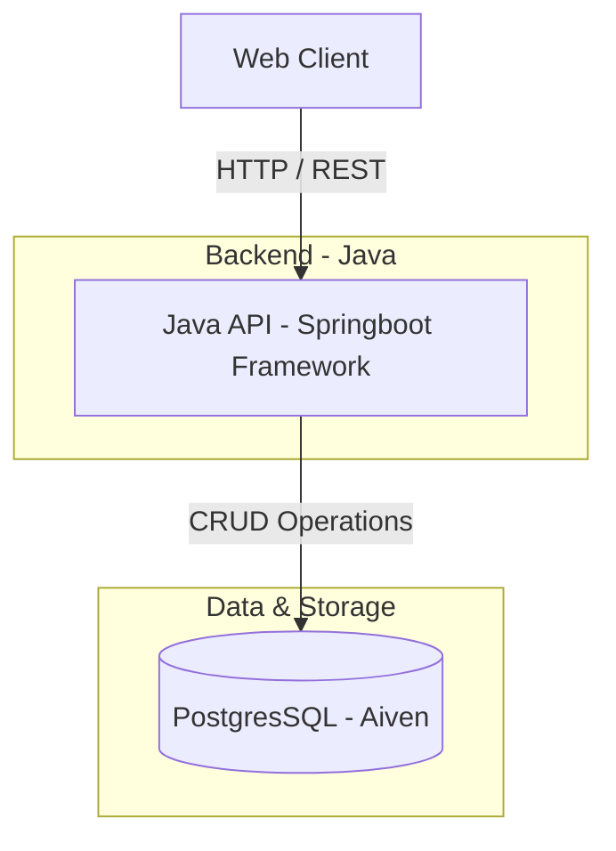
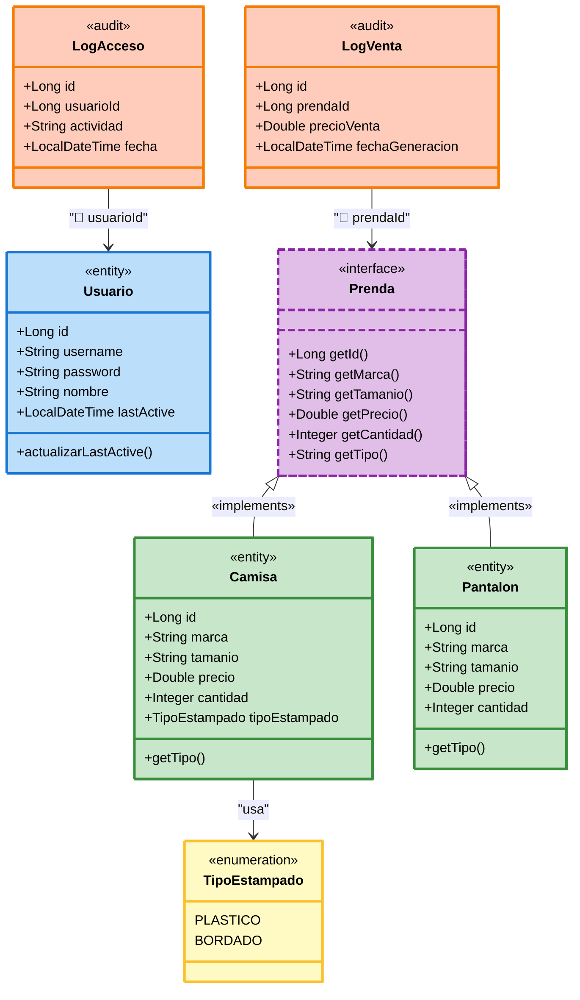

# 💬 Sistema de Venta y gestión de Inventario

Sistema de ventas e inventario de prendas, camisas y pantalones, con autenticación basada en JWT. Pruebas funcionales, unitarias e integración ademas de pruebas no fucionales de seguridad, carga y mantenibilidad. 

---

## 🏗️ Arquitectura

### Vista General (Contenedores)

Diagrama de clases del sistema de inventario

### Diagrama de interacción del sistema


### Estructura de carpetas API
Arquitectura Hexagonal de 4 capas
```
├── tienda/
├──── application/              # Aplicaciones sobre el core
│      └── Services/            # Servicios en la API
├──── domain/                   # Core de Negocio
|       ├── Model/              # Clases unicas del sistema
│       └── Ports/              # Funciones aplicadas a los modelos 
├──── infraestructure/          # Interacciones con servicios externos
|       ├── Persitency/         # Servicios con bases de datos (PostgreSQL)
|       |    ├── Adapter/      # Adapta el core a funciones de BD
|       |    ├── Entity/       # Clases Entendibles para la BD
|       |    ├── Mapper/       # Mappea los datos de la entidad
│       |    └── Repository/   # Interface para el adaptador y las entidades
│       └── Security/          # Configuraciones de seguridad, CORS, JWToken
├──── interfaces/              # Interacción con los usuarios
|       └── rest/              # Servicios Rest y controladores de la API
├──── Sqa/                     # Pruebas para medir calidad del Sw
```

### Diagrama de Clases
